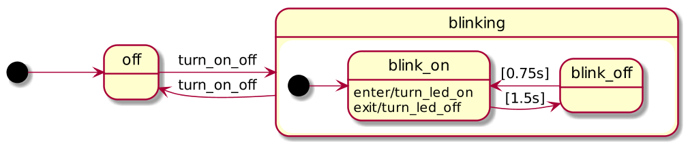

* [What is SObjectizer?](#what-is-sobjectizer)
* [What distinguishes SObjectizer?](#what-distinguishes-sobjectizer)
   * [SObjectizer is not like TBB, taskflow or HPX](#sobjectizer-is-not-like-tbb-taskflow-or-hpx)
* [Show me the code\!](#show-me-the-code)
  * [HelloWorld example](#helloworld-example)
  * [Ping\-Pong example](#ping-pong-example)
  * [Pub/Sub example](#pubsub-example)
  * [BlinkingLed example](#blinkingled-example)
  * [CSP\-like Ping\-Pong example](#csp-like-ping-pong-example)
  * [Another CSP\-example with Golang's like select() statement](#another-csp-example-with-golangs-like-select-statement)
  * [Want to know more?](#want-to-know-more)
* [Limitations](#limitations)
* [Obtaining and building](#obtaining-and-building)
  * [SObjectizer\-5\.7 requires C\+\+17\!](#sobjectizer-57-requires-c17)
  * [Building via Mxx\_ru](#building-via-mxx_ru)
  * [Building via CMake](#building-via-cmake)
  * [Building for Android](#building-for-android)
    * [Building with Android NDK](#building-with-android-ndk)
    * [Building with CrystaX NDK](#building-with-crystax-ndk)
  * [Using C\+\+ Dependency Managers](#using-c-dependency-managers)
    * [Using via vcpkg](#using-via-vcpkg)
    * [Using via Conan](#using-via-conan)
      * [Installing SObjectizer And Adding It To conanfile\.txt](#installing-sobjectizer-and-adding-it-to-conanfiletxt)
      * [Adding SObjectizer To Your CMakeLists\.txt](#adding-sobjectizer-to-your-cmakeliststxt)
* [License](#license)

Created by [gh-md-toc](https://github.com/ekalinin/github-markdown-toc.go)

# What is SObjectizer?

SObjectizer is one of a few cross-platform and OpenSource "actor frameworks"
for C++. But SObjectizer supports not only Actor Model, but also
Publish-Subscribe Model and CSP-like channels. The goal of SObjectizer is
significant simplification of development of concurrent and multithreaded
applications in C++.

SObjectizer allows the creation of a concurrent app as a set of agent-objects
which interact with each other through asynchronous messages. It handles
message dispatching and provides a working context for message processing. And
allows to tune those things by supplying various ready-to-use dispatchers.

# What distinguishes SObjectizer?

**Maturity**. SObjectizer is based on ideas that have been put forward in
1995-2000. And SObjectizer itself is being developed since 2002. SObjectizer-5
is continuously evolved since 2010.

**Stability**. From the very beginning SObjectizer was used for
business-critical applications, and some of them are still being used in
production. Breaking changes in SObjectizer are rare and we approach to them
very carefully.

**Cross-platform**. SObjectizer runs on Windows, Linux, FreeBSD, macOS and Android.

**Easy-to-use**. SObjectizer provides easy to understand and easy to use API
with a lot of examples in the SObjectizer's distributive and a plenty of
information in the project's Wiki.

**Free**. SObjectizer is distributed under BSD-3-CLAUSE license, so it can be
used in development of proprietary commercial software for free.

## SObjectizer is not like TBB, taskflow or HPX

SObjectizer is often compared with tools like Intel Threading Building Blocks, taskflow, HPX, and similar to them. Such comparison is just useless.

All those tools are intended to be used for solving tasks from Parallel Computing area: they allow to reduce the computational time by utilizing several CPU cores. For example, you can reencode your video file from one format to another within one hour on one CPU core, by it takes only 15 minutes on four cores. That is the main goal of Parallel Computing.

SObjectizer is intended for a slightly different area: Concurrent Computing. The main goal of SObjectizer is the simplification of doing many different tasks at once. Sometimes there is no need to use more than just one CPU core for that. But if there are several CPU cores, then SObjectizer makes the handling of those tasks and the interaction between them much easier.

The tricky part is the fact that Parallel- and Concurrent Computing use the same concurrency mechanisms and primitives (like threads, mutexes, atomics, and so on) under the hood. But from the high-level point of view Parallel- and Concurrent Computing are used for very different tasks.

As examples of applications that were or could be implemented on top of SObjectizer, we can list multithreaded proxy-server, automatic control system, MQ-broker, database server, and so on.

# Show me the code!

## HelloWorld example

This is a classical example "Hello, World" expressed by using SObjectizer's
agents:

```cpp
#include <so_5/all.hpp>

class hello_actor final : public so_5::agent_t {
public:
   using so_5::agent_t::agent_t;

   void so_evt_start() override {
      std::cout << "Hello, World!" << std::endl;
      // Finish work of example.
      so_deregister_agent_coop_normally();
   }
};

int main() {
   // Launch SObjectizer.
   so_5::launch([](so_5::environment_t & env) {
         // Add a hello_actor instance in a new cooperation.
         env.register_agent_as_coop( env.make_agent<hello_actor>() );
      });

   return 0;
}
```

## Ping-Pong example

Let's look at more interesting example with two agents and message exchange
between them. It is another famous example for actor frameworks, "Ping-Pong":

```cpp
#include <so_5/all.hpp>

struct ping {
   int counter_;
};

struct pong {
   int counter_;
};

class pinger final : public so_5::agent_t {
   so_5::mbox_t ponger_;

   void on_pong(mhood_t<pong> cmd) {
      if(cmd->counter_ > 0)
         so_5::send<ping>(ponger_, cmd->counter_ - 1);
      else
         so_deregister_agent_coop_normally();
   }

public:
   pinger(context_t ctx) : so_5::agent_t{std::move(ctx)} {}

   void set_ponger(const so_5::mbox_t mbox) { ponger_ = mbox; }

   void so_define_agent() override {
      so_subscribe_self().event( &pinger::on_pong );
   }

   void so_evt_start() override {
      so_5::send<ping>(ponger_, 1000);
   }
};

class ponger final : public so_5::agent_t {
   const so_5::mbox_t pinger_;
   int pings_received_{};

public:
   ponger(context_t ctx, so_5::mbox_t pinger)
      :  so_5::agent_t{std::move(ctx)}
      ,  pinger_{std::move(pinger)}
   {}

   void so_define_agent() override {
      so_subscribe_self().event(
         [this](mhood_t<ping> cmd) {
            ++pings_received_;
            so_5::send<pong>(pinger_, cmd->counter_);
         });
   }

   void so_evt_finish() override {
      std::cout << "pings received: " << pings_received_ << std::endl;
   }
};

int main() {
   so_5::launch([](so_5::environment_t & env) {
         env.introduce_coop([](so_5::coop_t & coop) {
               auto pinger_actor = coop.make_agent<pinger>();
               auto ponger_actor = coop.make_agent<ponger>(
                     pinger_actor->so_direct_mbox());

               pinger_actor->set_ponger(ponger_actor->so_direct_mbox());
            });
      });

   return 0;
}
```

All agents in the code above are working on the same work thread. How to bind
them to different work threads?

It is very simple. Just use an appropriate dispatcher:

```cpp
int main() {
   so_5::launch([](so_5::environment_t & env) {
         env.introduce_coop(
            so_5::disp::active_obj::make_dispatcher(env).binder(),
            [](so_5::coop_t & coop) {
               auto pinger_actor = coop.make_agent<pinger>();
               auto ponger_actor = coop.make_agent<ponger>(
                     pinger_actor->so_direct_mbox());

               pinger_actor->set_ponger(ponger_actor->so_direct_mbox());
            });
      });

   return 0;
}
```

## Pub/Sub example

SObjectizer supports Pub/Sub model via multi-producer/multi-consumer message
boxes. A message sent to that message box will be received by all subscribers
of that message type:

```cpp
#include <so_5/all.hpp>

using namespace std::literals;

struct acquired_value {
   std::chrono::steady_clock::time_point acquired_at_;
   int value_;
};

class producer final : public so_5::agent_t {
   const so_5::mbox_t board_;
   so_5::timer_id_t timer_;
   int counter_{};

   struct acquisition_time final : public so_5::signal_t {};

   void on_timer(mhood_t<acquisition_time>) {
      // Publish the next value for all consumers.
      so_5::send<acquired_value>(
            board_, std::chrono::steady_clock::now(), ++counter_);
   }

public:
   producer(context_t ctx, so_5::mbox_t board)
      :  so_5::agent_t{std::move(ctx)}
      ,  board_{std::move(board)}
   {}

   void so_define_agent() override {
      so_subscribe_self().event(&producer::on_timer);
   }

   void so_evt_start() override {
      // Agent will periodically recive acquisition_time signal
      // without initial delay and with period of 750ms.
      timer_ = so_5::send_periodic<acquisition_time>(*this, 0ms, 750ms);
   }
};

class consumer final : public so_5::agent_t {
   const so_5::mbox_t board_;
   const std::string name_;

   void on_value(mhood_t<acquired_value> cmd) {
      std::cout << name_ << ": " << cmd->value_ << std::endl;
   }

public:
   consumer(context_t ctx, so_5::mbox_t board, std::string name)
      :  so_5::agent_t{std::move(ctx)}
      ,  board_{std::move(board)}
      ,  name_{std::move(name)}
   {}

   void so_define_agent() override {
      so_subscribe(board_).event(&consumer::on_value);
   }
};

int main() {
   so_5::launch([](so_5::environment_t & env) {
         auto board = env.create_mbox();
         env.introduce_coop([board](so_5::coop_t & coop) {
               coop.make_agent<producer>(board);
               coop.make_agent<consumer>(board, "first"s);
               coop.make_agent<consumer>(board, "second"s);
            });

         std::this_thread::sleep_for(std::chrono::seconds(4));
         env.stop();
      });

   return 0;
}
```

## BlinkingLed example

All agents in SObjectizer are finite-state machines. Almost all functionality
of hierarchical finite-states machines (HSM) are supported: child states and
handlers inheritance, on_enter/on_exit handlers, state timeouts, deep- and
shallow state history, except orthogonal states.

Let's see how an agent that implements the following statechart can look like:



This is a very simple example that demonstrates an agent for the statechart shown above:

```cpp
#include <so_5/all.hpp>

using namespace std::literals;

class blinking_led final : public so_5::agent_t {
   state_t off{ this }, blinking{ this },
      blink_on{ initial_substate_of{ blinking } },
      blink_off{ substate_of{ blinking } };

public :
   struct turn_on_off : public so_5::signal_t {};

   blinking_led(context_t ctx) : so_5::agent_t{std::move(ctx)} {
      this >>= off;

      off.just_switch_to<turn_on_off>(blinking);

      blinking.just_switch_to<turn_on_off>(off);

      blink_on
         .on_enter([]{ std::cout << "ON" << std::endl; })
         .on_exit([]{ std::cout << "off" << std::endl; })
         .time_limit(1250ms, blink_off);

      blink_off
         .time_limit(750ms, blink_on);
   }
};

int main()
{
   so_5::launch([](so_5::environment_t & env) {
      so_5::mbox_t m;
      env.introduce_coop([&](so_5::coop_t & coop) {
            auto led = coop.make_agent< blinking_led >();
            m = led->so_direct_mbox();
         });

      const auto pause = [](auto duration) {
         std::this_thread::sleep_for(duration);
      };

      std::cout << "Turn blinking on for 10s" << std::endl;
      so_5::send<blinking_led::turn_on_off>(m);
      pause(10s);

      std::cout << "Turn blinking off for 5s" << std::endl;
      so_5::send<blinking_led::turn_on_off>(m);
      pause(5s);

      std::cout << "Turn blinking on for 5s" << std::endl;
      so_5::send<blinking_led::turn_on_off>(m);
      pause(5s);

      std::cout << "Stopping..." << std::endl;
      env.stop();
   } );

   return 0;
}
```

## CSP-like Ping-Pong example

SObjectizer allows to write concurrent applications even without agents inside.
Only plain threads and CSP-like channels can be used.

This is plain-thread implementation of Ping-Pong example (please note that
main() is not exception-safe):

```cpp
#include <so_5/all.hpp>

struct ping {
   int counter_;
};

struct pong {
   int counter_;
};

void pinger_proc(so_5::mchain_t self_ch, so_5::mchain_t ping_ch) {
   so_5::send<ping>(ping_ch, 1000);

   // Read all message until channel will be closed.
   so_5::receive( so_5::from(self_ch).handle_all(),
      [&](so_5::mhood_t<pong> cmd) {
         if(cmd->counter_ > 0)
            so_5::send<ping>(ping_ch, cmd->counter_ - 1);
         else {
            // Channels have to be closed to break `receive` calls.
            so_5::close_drop_content(self_ch);
            so_5::close_drop_content(ping_ch);
         }
      });
}

void ponger_proc(so_5::mchain_t self_ch, so_5::mchain_t pong_ch) {
   int pings_received{};

   // Read all message until channel will be closed.
   so_5::receive( so_5::from(self_ch).handle_all(),
      [&](so_5::mhood_t<ping> cmd) {
         ++pings_received;
         so_5::send<pong>(pong_ch, cmd->counter_);
      });

   std::cout << "pings received: " << pings_received << std::endl;
}

int main() {
   so_5::wrapped_env_t sobj;

   auto pinger_ch = so_5::create_mchain(sobj);
   auto ponger_ch = so_5::create_mchain(sobj);

   std::thread pinger{pinger_proc, pinger_ch, ponger_ch};
   std::thread ponger{ponger_proc, ponger_ch, pinger_ch};

   ponger.join();
   pinger.join();

   return 0;
}
```

## Another CSP-example with Golang's like select() statement

SObjectizer provides a select() function that is similar to Golang's select
statement. This function allows waiting for incoming messages from several
message chains. It also allows to wait for the readiness of message chains for
accepting a new outgoing message. So select() allows to do non-blocking send()
calls with the handling of incoming messages while the target message chain is
full.

There is a Fibonacci calculation example that uses select() as the
back-pressure mechanism (number producer thread will wait if number reader
thread doesn't read the previous number yet). Note also that main() function in
this example is exception-safe.

```cpp
#include <so_5/all.hpp>

#include <chrono>

using namespace std;
using namespace std::chrono_literals;
using namespace so_5;

struct quit {};

void fibonacci( mchain_t values_ch, mchain_t quit_ch )
{
   int x = 0, y = 1;
   mchain_select_result_t r;
   do
   {
      r = select(
         from_all().handle_n(1),
         // Sends a new message of type 'int' with value 'x' inside
         // when values_ch is ready for a new outgoing message.
         send_case( values_ch, message_holder_t<int>::make(x),
               [&x, &y] { // This block of code will be called after the send().
                  auto old_x = x;
                  x = y; y = old_x + y;
               } ),
         // Receive a 'quit' message from quit_ch if it is here.
         receive_case( quit_ch, [](quit){} ) );
   }
   // Continue the loop while we send something and receive nothing.
   while( r.was_sent() && !r.was_handled() );
}

int main()
{
   wrapped_env_t sobj;

   thread fibonacci_thr;
   auto thr_joiner = auto_join( fibonacci_thr );

   // The chain for Fibonacci number will have limited capacity.
   auto values_ch = create_mchain( sobj, 1s, 1,
         mchain_props::memory_usage_t::preallocated,
         mchain_props::overflow_reaction_t::abort_app );

   auto quit_ch = create_mchain( sobj );
   auto ch_closer = auto_close_drop_content( values_ch, quit_ch );

   fibonacci_thr = thread{ fibonacci, values_ch, quit_ch };

   // Read the first 10 numbers from values_ch.
   receive( from( values_ch ).handle_n( 10 ),
         // And show every number to the standard output.
         []( int v ) { cout << v << endl; } );

   send< quit >( quit_ch );
}
```

## Want to know more?

More information about SObjectizer can be found in the corresponding section of
the [project's Wiki](https://github.com/Stiffstream/sobjectizer/wiki).

# Limitations

SObjectizer is an in-process message dispatching framework. It doesn't support
distributed applications just out of box. But external tools and libraries can
be used in that case. Please take a look at our mosquitto_transport experiment:
https://github.com/Stiffstream/mosquitto_transport

# Obtaining and building

SObjectizer can be checked out from [GitHub](https://github.com/stiffstream/sobjectizer). Archives with SObjectizer's source code can be downloaded
from [GitHub](https://github.com/Stiffstream/sobjectizer/releases) or from [SourceForge](https://sourceforge.net/projects/sobjectizer/files/sobjectizer).

There are two ways for building SObjectizer.
The first one by using [Mxx_ru](https://sourceforge.net/projects/mxxru/)
tool. The second one by using [CMake](https://cmake.org).

NOTE. Since v.5.5.15.2 there is a support of Android platform.  Building for
Android is possible by CMake only. See the corresponding section below.

SObjectizer can also be installed and used via **vcpkg** and **Conan**
dependency managers. See the appropriate sections below.

## SObjectizer-5.7 requires C++17!

The 5.7-branch of SObjectizer requires C++17.

If you need support for C++14 or C++11 try to look to older versions of
SObjectizer on [SourceForge](https://sourceforge.net/projects/sobjectizer).  Or
contact [stiffstream](https://stiffstream.com/en/services.html) to discuss
porting of SObjectizer-5.7 to older C++ standards.

## Building via Mxx_ru

*NOTE. This is a standard way for building SObjectizer. This way is used in
SObjectizer development process.*

To build SObjectizer it is necessary to use Ruby language and Mxx_ru tool.
Install Ruby and then install Mxx_ru via RubyGems command:

```sh
gem install Mxx_ru
```

If you already have Mxx_ru installed please update to at least version 1.6.14.6:

```sh
gem update Mxx_ru
```

SObjectizer can be obtained from Git repository on GitHub:

```sh
git clone https://github.com/stiffstream/sobjectizer
```

To build SObjectizer:

```sh
cd sobjectizer/dev
ruby build.rb
```

Static and shared library for SObjectizer will be built. Libraries will be
placed into target/release subdirectory.

If you want to build just shared library:

```sh
cd sobjectizer/dev
ruby so_5/prj.rb
```

Or if you want to build just static library:

```sh
cd sobjectizer/dev
ruby so_5/prj_s.rb
```

To build SObjectizer with all tests and samples:

```sh
cd sobjectizer/dev
ruby build_all.rb
```

Please note that under FreeBSD it could be necessary to define LD_LIBRARY_PATH
environment variable. And the actual build command sequence under FreeBSD could
be as follows:

```sh
cd sobjectizer/dev
export LD_LIBRARY_PATH=target/release
ruby build_all.rb
```

To build html-format documentation for SObjectizer the Doxygen tool is
necessary. If it is installed then:

```sh
cd sobjectizer/doxygen
doxygen
```

Generated html-files will be located in sobjectizer/dev/doc/html.

NOTE. If you do not specify MXX_RU_CPP_TOOLSET by youself then Mxx_ru will
try to detect your C++ toolset automatically. If you want to use C++ compiler
which is not default in your system please define MXX_RU_CPP_TOOLSET
environment variable manually. It could look like:

```sh
export MXX_RU_CPP_TOOLSET="clang_linux compiler_name=clang++-6 linker_name=clang++-6"
```

More information about tuning Mxx_ru for your needs you can find in the
[corresponding documentation](http://sourceforge.net/projects/mxxru/files/Mxx_ru%201.6/mxx_ru-1.6.4-r1.pdf/download).

## Building via CMake

To build SObjectizer via CMake it is necessary to have CMake and some knowledge
of how to use it. The following action is just a demonstration. For more 
detailed info about cmake build system for SObjectizer see
dev/cmake/CmakeQuickHowto.txt

To get and build SObjectizer under Linux/FreeBSD in command line run:

```sh
git clone https://github.com/stiffstream/sobjectizer
cd sobjectizer
mkdir cmake_build
cd cmake_build
cmake -DCMAKE_INSTALL_PREFIX=target -DCMAKE_BUILD_TYPE=Release ../dev
cmake --build . --config Release
cmake --build . --config Release --target install
```

Those commands will create all necessary Makefile, then build SObjectizer. If
it necessary to build examples and tests too, use

```sh
cmake -DBUILD_ALL=ON -DCMAKE_INSTALL_PREFIX=target ../dev
```

When 'make install' finished './target' will contain two subfolders
'./bin' with samples and './lib' with shared libso.5.x.x.so

CMake build system currently supports this options:

* `SOBJECTIZER_BUILD_STATIC`. Enable building SObjectizer as a static library [default: ON]
* `SOBJECTIZER_BUILD_SHARED`. Enable building SObjectizer as a shared library [default: ON]
* `BUILD_ALL`. Enable building examples and tests [default: OFF]
* `BUILD_EXAMPLES`. Enable building examples [default: OFF]
* `BUILD_TESTS`. Enable building tests [default: OFF]

Please note that if `BUILD_ALL` or `BUILD_EXAMPLES` or `BUILD_TESTS` is turned
ON then both `SOBJECTIZER_BUILD_STATIC` and `SOBJECTIZER_BUILD_SHARED` must be
turned ON. It means that if `SOBJECTIZER_BUILD_STATIC` or
`SOBJECTIZER_BUILD_SHARED` is turned OFF then
`BUILD_ALL`/`BUILD_EXAMPLES`/`BUILD_TESTS` all must be turned OFF.

To build SObjectizer under Windows by MS Visual Studio 2013 from command line:

```sh
git clone https://github.com/stiffstream/sobjectizer
cd sobjectizer
mkdir cmake_build
cd cmake_build
cmake -DCMAKE_INSTALL_PREFIX=target -DCMAKE_BUILD_TYPE=Release -G "Visual Studio 15 2017" ../dev
cmake --build . --config Release
cmake --build . --config Release --target install
```

If it necessary to build examples too, use `BUILD_ALL` in cmake invocation:

```sh
cmake -DCMAKE_INSTALL_PREFIX=target -DCMAKE_BUILD_TYPE=Release -DBUILD_ALL=ON -G "Visual Studio 15 2017" ../dev
```

Since v.5.5.24 SObjectizer provides sobjectizer-config.cmake files.
These files are automatically installed into `<target>/lib/cmake/sobjectizer`
subfolder. It allows to use SObjectizer via CMake's find_package command.

## Building for Android

Building for Android is possible via a rather fresh Android NDK or [CrystaX
NDK](https://www.crystax.net/android/ndk).

### Building with Android NDK

You need Android SDK and Android NDK installed in your system. As well as an
appropriate version of CMake. You have also need properly set environment
variables `ANDROID_HOME`, `ANDROID_NDK`. Then you can issue the following
commands:

```sh
git clone https://github.com/stiffstream/sobjectizer
cd sobjectizer
mkdir cmake_build
cd cmake_build
cmake -DBUILD_ALL -DCMAKE_INSTALL_PREFIX=target -DCMAKE_BUILD_TYPE=Release \
     -DCMAKE_TOOLCHAIN_FILE=${ANDROID_NDK}/build/cmake/android.toolchain.cmake \
     -G Ninja \
     -DANDROID_ABI=arm64-v8a \
     -DANDROID_NDK=${ANDROID_NDK} \
     -DANDROID_NATIVE_API_LEVEL=23 \
     -DANDROID_TOOLCHAIN=clang \
     ../dev
cmake --build . --config=Release
cmake --build . --config=Release --target install
```

### Building with CrystaX NDK

You need CrystaX NDK v.10.4.0 or higher already installed in your system. CMake
is used for building SObjectizer:

```sh
git clone https://github.com/stiffstream/sobjectizer
cd sobjectizer
mkdir cmake_build
cd cmake_build
export NDK=/path/to/the/crystax-ndk
cmake -DBUILD_ALL -DCMAKE_INSTALL_PREFIX=result -DCMAKE_TOOLCHAIN_FILE=$NDK/cmake/toolchain.cmake -DANDROID_ABI=arm64-v8a ../dev
make
make test
make install
```

## Using C++ Dependency Managers

### Using via vcpkg

To use SObjectizer via [vcpkg](https://github.com/Microsoft/vcpkg) it is necessary to do the following steps.

Install `sobjectizer` package:

```sh
vcpkg install sobjectizer
```

Add the following lines into your CMakeLists.txt file:

```cmake
find_package(sobjectizer CONFIG REQUIRED)
target_link_libraries(your_target sobjectizer::SharedLib) # or sobjectizer::StaticLib
```

### Using via Conan

**NOTE.** Since Feb 2021 new versions of SObjectizer are available via [conan-center](https://conan.io/center/) only.

#### Installing SObjectizer And Adding It To conanfile.txt

To use SObjectizer via Conan it is necessary to add SObjectizer to
`conanfile.txt` of your project:

```
[requires]
sobjectizer/5.7.2.3
```

It also may be necessary to specify `shared` option for SObjectizer. For example, for build SObjectizer as a static library:

```
[options]
sobjectizer:shared=False
```

Install dependencies for your project:

```
conan install SOME_PATH --build=missing
```

#### Adding SObjectizer To Your CMakeLists.txt

```cmake
...
include(${CMAKE_BINARY_DIR}/conanbuildinfo.cmake)
conan_basic_setup()

...
target_link_libraries(your_target ${CONAN_LIBS})
```

# License

SObjectizer is distributed under 3-clause BSD license. For license information
please see LICENSE file.

